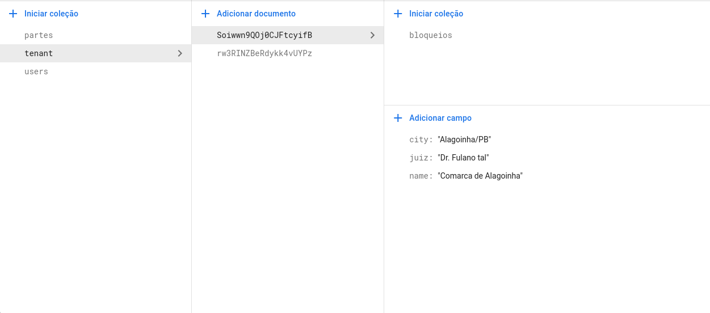
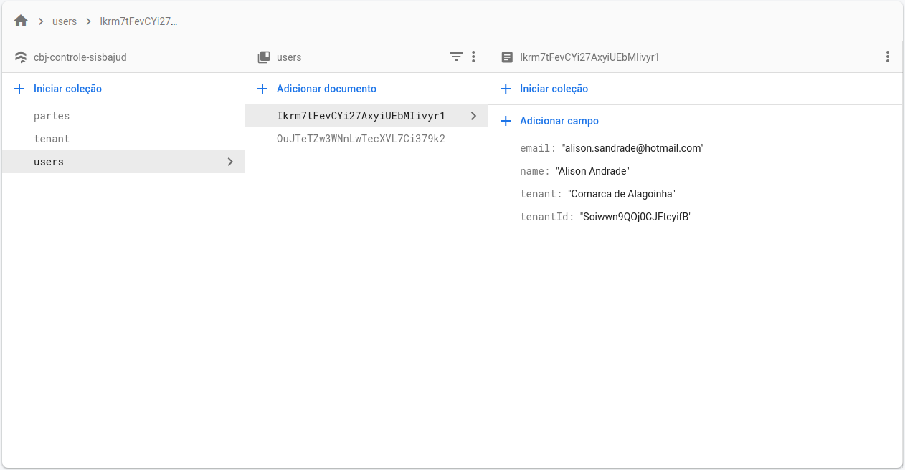
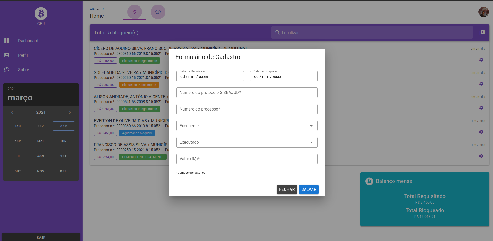

[![Contributors][contributors-shield]][contributors-url]
[![Forks][forks-shield]][forks-url]
[![Stargazers][stars-shield]][stars-url]
[![Issues][issues-shield]][issues-url]
[![MIT License][license-shield]][license-url]
[![LinkedIn][linkedin-shield]][linkedin-url]


<!-- PROJECT LOGO -->
<br />
<p align="center">
  <a href="https://github.com/alisonsandrade/vue-fire-cbj">
    
  </a>

  <h3 align="center">CBJ Controle de Bloqueios Judiciais</h3>

  <p align="center">
    Sistema para controle e gerenciamento interno das requisições de bloqueios judiciais via SISBAJUD.    
  </p>
</p>


<!-- TABLE OF CONTENTS -->
<details open="open">
  <summary>Conteúdo</summary>
  <ol>
    <li>
      <a href="#sobre-o-projeto">Sobre o Projeto</a>
      <ul>
        <li><a href="#tecnologias">Tecnologias</a></li>
      </ul>
    </li>
    <li>
      <a href="#iniciado-o-projeto">Iniciando o projeto</a>
      <ul>
        <li><a href="#prerequisitos">Prerequisitos</a></li>
        <li><a href="#instalacao">Instalação</a></li>
      </ul>
    </li>    
    <li><a href="#contribuindo">Contribuindo</a></li>
    <li><a href="#licenca">Licença</a></li>
    <li><a href="#contato">Contato</a></li>
    <li><a href="#telas-do-sistema">Telas do Sistema</a></li>
  </ol>
</details>


<!-- ABOUT THE PROJECT -->
## Sobre o Projeto


O CBJ é um software livre desenvolvido pensando em ajudar no controle dos bloqueio judiciais via SISBAJUD por parte dos juízes e assessores. Na prática forense, em muitos processos o poder Judiciário é obrigado a bloquear judicialmente numerário para pagamento das execuções que não são cumpridas voluntariamente. Esse bloqueio se dá por meio do sistema SISBAJUD.

Contudo, o bloqueio judicial não se dá de forma automática, há um prazo mínimo de 48 horas para processamento das informações por parte do Banco Central, o que dificulta o controle dos bloqueios já requisitados e já cumpridos. 
É nesse sentido que o CBJ vem como uma solução de software livre para auxiliar os juízes e assessores no controle dos processos que já sofreram constrição SISBAJUD e quais ainda não tiveram a ordem cumprida.

Porque usar o CBJ?:
* Possibilidade de gerenciar todas as requisições judiciais de bloqueio SISBAJUD;
* Controle mensal do total que já foi bloqueado e do total requisitado;


### Tecnologias
O CBJ foi desenvolvido com Vue Framework, VuetifyJS e Firebase. No firebase optou-se pela utilização do Firestore para armazenamento do banco de dados e a autenticação por e-mail e senha.
* [VueJS](https://vuejs.org/)
* [Firebase](https://firebase.google.com/?hl=pt-br)
* [Vuetifyjs](https://vuetifyjs.com/en/)


<!-- GETTING STARTED -->
## Iniciando o Projeto
O CBJ utiliza apenas tecnologias livres o que permite que qualquer um tenha acesso ao sistema sem precisar de dispor de recursos financeiros para a sua manutenção.


### Prerequisitos
Os prerequisitos para instalação e utilização do CBJ são node.js, VueJS 2.x e Firebase.
* npm
  ```sh
  npm install npm@latest -g
  ```
* [VueJS](https://br.vuejs.org/v2/guide/installation.html)


## Instalação do projeto
1. É necessário criar um banco de dados [Firestore da Firebase] (https://console.firebase.google.com/u/0/?hl=pt-br) e preencher as variáveis de ambiente com as configurações do seu projeto Firebase. Para isso renomeie o arquivo .env_example para .env

2. Clonar o repositório
```
git clone https://github.com/alisonsandrade/vue-fire-cbj.git
```

3. Instalação do projeto
```
yarn install
```

### Compiles and hot-reloads for development
```
yarn serve
```

### Compiles and minifies for production
```
yarn build
```

### Lints and fixes files
```
yarn lint
```

4. Configurações do Banco de Dados
O projeto utiliza o Firebase como base de dados e suas coleções foram projetadas de forma a suportar o acesso via multi tenant. Dada a simplicidade do sistema e o objetivo que se pretende alcançar, para que funcione o multi tenant se faz necessária algumas configurações manuais no **Cloud Firestore**.
São necessárias as criações manuais de duas coleções na raiz do Cloud Firestore. 
```tenant``` e ```users```
Na coleção tenant é onde se abrigará as informações da unidade judiciária que armazenará a coleção de bloqueios judiciais. É campo obrigatório dessa coleção o **name**.


Por fim, se faz necessária mais uma configuração manual quanto aos usuários. A collection **users** deverá possuir todos os usuários do sistema. Em seu id deverá ser adicionado o **uid** do usuário cadastrado no **Authentication**. Como campos obrigatórios da coleção deverá conter:
* e-mail (o mesmo cadastrado no Authentication)
* name (o mesmo cadastrado no Authentication)
* tenant (o nome do tenant ao qual o usuário estará vinculado)
* tenantId (o id do tenant ao qual o usuário estará vinculado)



<!-- CONTRIBUTING -->
## Contribuindo

Contributions are what make the open source community such an amazing place to be learn, inspire, and create. Any contributions you make are **greatly appreciated**.

1. Fork the Project
2. Create your Feature Branch (`git checkout -b feature/AmazingFeature`)
3. Commit your Changes (`git commit -m 'Add some AmazingFeature'`)
4. Push to the Branch (`git push origin feature/AmazingFeature`)
5. Open a Pull Request


<!-- LICENSE -->
## Licença
Distribuído sob a licença MIT. Veja `LICENSE` para mais informações.


<!-- CONTACT -->
## Contato

Alison Andrade - [@alison_sandrade](https://twitter.com/alison_sandrade) - alison.sandrade@hotmail.com

Link do Projeto: [https://github.com/alisonsandrade/vue-fire-cbj](https://github.com/alisonsandrade/vue-fire-cbj)


<!-- TELAS DO SISTEMA -->
## Telas do Sistema



<!-- MARKDOWN LINKS & IMAGES -->
<!-- https://www.markdownguide.org/basic-syntax/#reference-style-links -->
[contributors-shield]: https://img.shields.io/github/contributors/othneildrew/Best-README-Template.svg?style=for-the-badge
[contributors-url]: https://github.com/alisonsandrade/vue-fire-cbj/graphs/contributors
[forks-shield]: https://img.shields.io/github/forks/othneildrew/Best-README-Template.svg?style=for-the-badge
[forks-url]: https://github.com/alisonsandrade/vue-fire-cbj/network/members
[stars-shield]: https://img.shields.io/github/stars/othneildrew/Best-README-Template.svg?style=for-the-badge
[stars-url]: https://github.com/alisonsandrade/vue-fire-cbj/stargazers
[issues-shield]: https://img.shields.io/github/issues/othneildrew/Best-README-Template.svg?style=for-the-badge
[issues-url]: https://github.com/alisonsandrade/vue-fire-cbj/issues
[license-shield]: https://img.shields.io/github/license/othneildrew/Best-README-Template.svg?style=for-the-badge
[license-url]: https://github.com/alisonsandrade/vue-fire-cbj/blob/main/LICENSE
[linkedin-shield]: https://img.shields.io/badge/-LinkedIn-black.svg?style=for-the-badge&logo=linkedin&colorB=555
[linkedin-url]: https://linkedin.com/in/alisonsandrade
[product-screenshot]: images/screenshot.png
